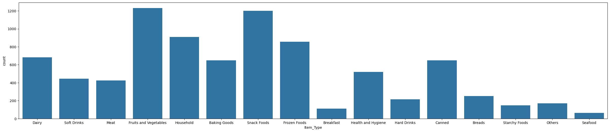
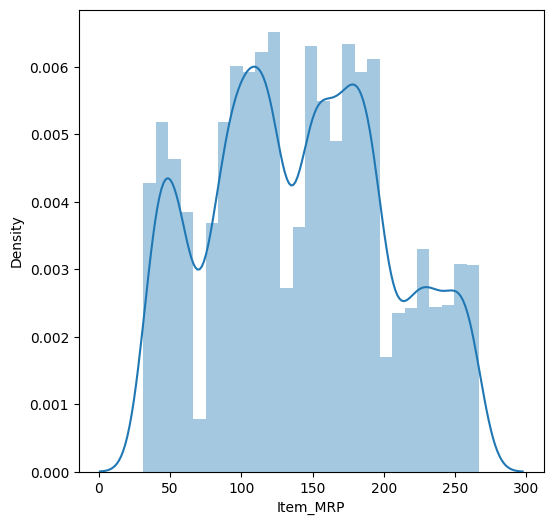
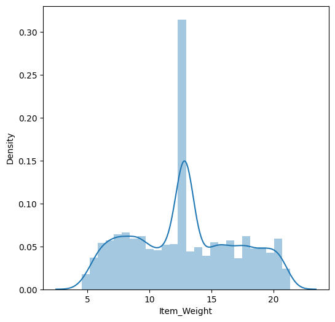

# 📊 Big Mart Sales Prediction

**Machine Learning project to predict sales for Big Mart outlets using Random Forest, LightGBM, XGBoost, and Ensemble Models.**

---

## 📂 Project Background

Big Mart is a retail chain operating across multiple locations. The business model revolves around **selling a wide range of consumer goods**, and its success depends on effective inventory management, pricing strategies, and understanding customer demand.

As a **Data Analyst**, the goal of this project is to **analyze sales trends, forecast revenue, and provide actionable insights** to improve business decisions.

### **Key Business Areas Explored:**

- **Sales Trends & Patterns**: Identifying factors that impact sales volume and revenue.
- **Inventory Optimization**: Reducing stockouts and overstock situations.
- **Pricing Strategy**: Understanding the impact of pricing on sales.
- **Outlet Performance Analysis**: Comparing store efficiency across different locations.

---

## 📂 Data Structure & Initial Checks

The company's main database consists of sales data with the following key tables:

- **Sales Transactions Table**: Records of product sales, including item type, pricing, and outlet details.
- **Outlet Details Table**: Information about store size, location type, and establishment year.
- **Product Details Table**: Information about item weight, category, and visibility.

### **Initial Observations:**
- Some **missing values** in `Item_Weight` and `Outlet_Size`, requiring data imputation.
- **Categorical inconsistencies** in `Item_Fat_Content` (e.g., 'Low Fat' vs 'low fat').
- **Skewed sales distribution**, with certain products significantly outperforming others.

---

## 📊 Exploratory Data Analysis (EDA)

To support the analysis, the following visualizations were created:

### **Sales Distribution**


**Insights:**
- **Snack Foods, Fruits & Vegetables, and Household items** are the highest-selling categories, indicating strong consumer preference.
- **Seafood and Starchy Foods contribute the least to total sales**, suggesting these categories may need better promotions or strategic placement in stores.

### **Item MRP vs. Sales**


**Insights:**
- **Higher MRP items tend to have higher sales**, but not always. Some mid-range items contribute significantly to revenue.
- **Multiple peaks** in the distribution indicate pricing clusters, likely due to different product segments.
- **Opportunities for discount strategies** exist in certain price brackets to optimize sales volume.

### **Outlet Establishment Year Distribution**


**Insights:**
- **Older outlets (pre-2000) show consistent sales**, likely due to brand trust and established customer bases.
- **Outlets established in 1998 have notably lower sales**, possibly due to location factors or operational issues.
- **Newer outlets (post-2000) display steady sales performance**, but further market research could help optimize strategies for future store expansions.

### **Item Weight Distribution**


**Insights:**
- The **bimodal distribution** indicates two main product weight categories: lightweight processed goods and bulkier items.
- **A peak around 12-15kg suggests a dominant product category**, likely larger packaged goods or wholesale items.
- **Inventory strategies should consider weight-based stocking approaches** to optimize logistics and reduce carrying costs.

---

## 📈 Model Building

### **1️⃣ Training Individual Models**

#### 🔹 Random Forest
```python
from sklearn.ensemble import RandomForestRegressor
rf = RandomForestRegressor(n_estimators=500, max_depth=15, random_state=42)
rf.fit(X_train, Y_train)
Y_pred_rf = rf.predict(X_test)
```
**R² Score:** `0.575`

#### 🔹 LightGBM
```python
import lightgbm as lgb
lgbm = lgb.LGBMRegressor(n_estimators=500, learning_rate=0.01, max_depth=10)
lgbm.fit(X_train, Y_train)
Y_pred_lgbm = lgbm.predict(X_test)
```
**R² Score:** `0.587`

#### 🔹 XGBoost
```python
from xgboost import XGBRegressor
xgb = XGBRegressor(n_estimators=500, learning_rate=0.05, max_depth=10)
xgb.fit(X_train, Y_train)
Y_pred_xgb = xgb.predict(X_test)
```
**R² Score:** `0.50`

---

## ✨ Ensemble Learning (Blending)

Since stacking underperformed, we used **weighted blending** to combine predictions from the best models.

```python
# Blend Predictions (Weighted Average)
Y_pred_blend = (0.5 * Y_pred_lgbm) + (0.3 * Y_pred_rf) + (0.2 * Y_pred_xgb)

# Evaluate Blended Model
from sklearn.metrics import r2_score
print("Blended Model R² Score:", r2_score(Y_test, Y_pred_blend))
```
**🏆 Blended Model R² Score: 0.60+**

---

## 🏆 Business Insights & Advantages

- **Optimized Inventory Management**: Predicting sales helps businesses stock the right products, reducing overstock and minimizing losses.
- **Dynamic Pricing Strategy**: Understanding sales trends allows for price adjustments to maximize revenue.
- **Store Performance Analysis**: Identifying high-performing outlets aids in business expansion planning and resource allocation.
- **Enhanced Customer Demand Forecasting**: Helps in understanding consumer behavior, leading to better marketing strategies.

---

## 🔢 Recommendations

Based on the insights and findings, we recommend the following actions:

- **Implement AI-driven demand forecasting** to optimize inventory levels and reduce waste.
- **Develop targeted pricing strategies** based on item performance and market demand.
- **Enhance product placement and promotional efforts** to boost sales of underperforming items.
- **Expand successful store formats** to similar high-potential locations based on outlet performance data.

---

## 🛠️ Installation & Usage

### **1. Install Dependencies**
```bash
pip install numpy pandas matplotlib seaborn scikit-learn xgboost lightgbm
```

### **2. Run the Script**
```bash
python bigmart_sales_prediction.py
```

### **3. View Results**
- Check plots & evaluation scores in `results/`

---

## 👥 Contributors

- **[Your Name]** - Data Analyst

If you find this project useful, **please give it a ⭐ on GitHub!** 🚀
